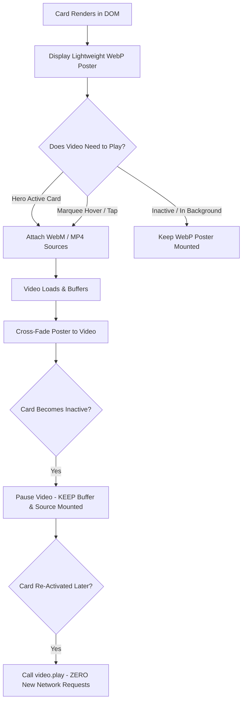

# Shree Ram Production — Website & Media Performance Optimization

> **Official Website:** [Shree Ram Production](https://www.shreeramproduction.in/)  
> **Core Engineering Directive:**  
> *"Do not make every video load faster. Instead, prevent unnecessary videos from loading at all."*

A modern, high-performance web platform for **Shree Ram Production** — a full-service creative production, branding, marketing, and digital growth agency.

Built with **React 19**, **Vite**, **TypeScript**, and **GSAP**, featuring an industry-standard **Poster-First / Video-Facade & Progressive Persistent Loading Architecture** for videos and images.

---

## 📑 Table of Contents

1. [The Performance Problem (Before Optimization)](#1-the-performance-problem-before-optimization)
2. [Optimization Highlights & Benchmark Comparison](#2-optimization-highlights--benchmark-comparison)
3. [Video Loading Optimization Architecture](#3-video-loading-optimization-architecture)
   - [Poster-First / Video-Facade Pattern](#a-poster-first--video-facade-pattern)
   - [Hero Orbit: Progressive Persistent Loading](#b-hero-orbit-progressive-persistent-loading)
   - [Portfolio Marquee: Hover & Tap Activation](#c-portfolio-marquee-hover--tap-activation)
   - [Video Encoding & Delivery Specifications](#d-video-encoding--delivery-specifications)
   - [Zero Layout Shift (CLS Protection)](#e-zero-layout-shift-cls-protection)
   - [Mobile Autoplay Policy Handling](#f-mobile-autoplay-policy-handling)
4. [Photo & Image Optimization Architecture](#4-photo--image-optimization-architecture)
   - [Modern WebP Conversion (99.5% Reduction)](#a-modern-webp-conversion-995-reduction)
   - [Single LCP Asset Prioritization](#b-single-lcp-asset-prioritization)
   - [On-Demand Slideshow Preload Engine](#c-on-demand-slideshow-preload-engine)
   - [Universal Lazy Loading & Async Decoding](#d-universal-lazy-loading--async-decoding)
5. [Complete Website Media Inventory](#5-complete-website-media-inventory)
6. [Key Files & Codebase Map](#6-key-files--codebase-map)
7. [Getting Started & Development](#7-getting-started--development)

---

## 1. The Performance Problem (Before Optimization)

Prior to optimization, the website suffered from severe initial page lag, bandwidth choking, and network duplication:

1. **Initial Video Stampede:**  
   The Hero 3D orbit section (6 cards) and Portfolio cinematic showreel (multiple continuous marquee tracks with duplicate cards) simultaneously mounted `<video>` elements. On initial page load, **15–20+ video elements requested media concurrently**, downloading over **100 MB of video data**.
2. **Carousel Rotation Re-Downloads:**  
   When cards in the Hero carousel rotated away and became inactive, their `<video>` elements were unmounted. When rotated back into view, the browser re-requested the entire video file, causing repeated network downloads of the same `.webm` files (accumulating 98 MB+ on prolonged interaction).
3. **Huge Image Assets:**  
   A team photograph (`Arjun-2.png`) was bundled at an uncompressed **11.6 MB**.
4. **Slideshow Mount Stampede:**  
   Multi-photo showcase cards ran eager preload loops on mount, requesting dozens of project screenshots simultaneously before the user even scrolled down.

---

## 2. Optimization Highlights & Benchmark Comparison

| Metric / Dimension | Before Optimization | After Optimization | Improvement |
| :--- | :--- | :--- | :--- |
| **Initial Video Requests** | 15–20+ streams concurrently | **1 stream** (Hero active card only) | **~95% reduction** |
| **Initial Video Transfer** | 100+ MB immediately requested | **~5.3 MB** (Single active WebM) | **~95% bandwidth saved** |
| **Hero Carousel Cycle 2+** | Re-requested files (98 MB+ cumulative) | **0 new requests** (re-plays buffered media) | **100% deduplication** |
| **Hero Orbit Loading** | All 6 cards loaded videos | **1 active video, 5 WebP posters** (~35 KB each) | Zero initial stampede |
| **Portfolio Marquee Loading** | Duplicated cards loaded videos | **WebP posters by default**; loads on hover/tap | Zero initial marquee load |
| **Team Image Asset** | 11.6 MB (`Arjun-2.png`) | **51.2 KB** (`Arjun-2.webp`) | **99.5% reduction** |
| **Slideshow Photo Preload** | All photos loaded at once | **Next slide only on-demand** + lazy loading | Smooth memory profile |
| **LCP Preload Strategy** | None / Competing with video | **Single LCP poster preloaded** (`fetchpriority="high"`) | Fast above-the-fold paint |
| **Layout Shift (CLS)** | Risk of shifts when videos load | **Strict aspect ratios (9/16, 16/10)** locked | **Zero layout shift** |
| **Visual Design & UX** | Original | **100% Identical** | No visual compromise |

---

## 3. Video Loading Optimization Architecture

### A. Poster-First / Video-Facade Pattern
Implemented in `src/components/ui/VideoFacade.tsx` and exported via `src/components/ui/OptimizedVideo.tsx`:



- **Lightweight Poster First:** Always renders an optimized WebP thumbnail poster (`~20–50 KB`).
- **No Early Network Calls:** `<source>` tags are **never rendered** and video files are **never fetched** until activated.

### B. Hero Orbit: Progressive Persistent Loading
In `src/components/Hero.tsx`, 6 cards orbit continuously on an elliptical GSAP track:
- **Separation of Source Attachment and Playback:**
  - `hasAttached` state: initialized to `true` **only** for Card 0 (`active === true`). Cards 1–5 initialize to `false`.
  - When Card 0 mounts: only `Royal-Enfeild.webm` is downloaded.
  - When carousel rotates to Card 1 for the **first time**: Card 1 attaches its source and buffers its video.
  - When Card 0 becomes inactive: `safePause()` pauses playback. **The `<video>` element is NOT destroyed, `<source>` is NOT removed, and `video.load()` is NOT called.**
  - **Second+ Carousel Cycles:** When Card 0 becomes active again, `safePlay()` (`video.play()`) resumes playback from the existing buffer with **ZERO new network requests**.

### C. Portfolio Marquee: Hover & Tap Activation
In `src/components/Portfolio.tsx`:
- **Desktop:** The 3 moving rows default to WebP posters. When a user hovers over a reel card (`onMouseEnter`), the video attaches, loads, and plays. When mouse leaves (`onMouseLeave`), the video pauses.
- **Mobile:** Tapping a card (`onTouchStart`) toggles playback.
- **Infinite Track Duplication:** The duplicated cards (`[...row1Projects, ...row1Projects]`) duplicate only lightweight WebP posters, completely eliminating video request multiplication.

### D. Video Encoding & Delivery Specifications
All reel videos in `public/reels/` conform to web delivery standards:
- **Dual Formats:**
  1. Primary: **WebM format** (`libvpx-vp9`, high efficiency compression).
  2. Fallback: **MP4 format** (`H.264`, `+faststart` moov atom at file head for instant start).
- **Target Resolution:** Scaled to **540 × 960** (9:16 vertical reels) matching display cards.
- **Audio:** Stripped (`-an`) on decorative background reels to save bandwidth.
- **Attributes:** `preload="metadata"`, `muted`, `loop`, `playsInline`.

### E. Zero Layout Shift (CLS Protection)
- Container elements lock dimensions with `aspect-ratio: 9/16` for reels and `16/10` for development projects.
- Poster image has `position: absolute; inset: 0; width: 100%; height: 100%; object-fit: cover`.
- Video element has `position: absolute; inset: 0; width: 100%; height: 100%; object-fit: cover`.
- Transitions use smooth opacity cross-fades (`opacity: isVideoReady ? 1 : 0`).

### F. Mobile Autoplay Policy Handling
- Enforces programmatic `video.muted = true` and `video.defaultMuted = true` to satisfy iOS Safari and Android Chrome requirements.
- Catches promise rejections silently and registers a one-time touch interaction listener to automatically retry playback if blocked by power-saving modes.

---

## 4. Photo & Image Optimization Architecture

### A. Modern WebP Conversion (99.5% Reduction)
- **Problem:** `src/assets/out team/Arjun-2.png` was 11.6 MB, bloating the client bundle.
- **Solution:** Converted to `src/assets/out team/Arjun-2.webp` at **51.2 KB** with identical visual fidelity.
- **Result:** **99.5% file size reduction** directly removed from the application bundle.

### B. Single LCP Asset Prioritization
In `index.html`, added a high-priority preload tag for the single confirmed above-the-fold Largest Contentful Paint (LCP) element (the active Hero card poster):

```html
<!-- Preload Primary LCP Asset (Hero Active Card Poster) -->
<link rel="preload" as="image" href="/reels/posters/Royal-Enfeild.webp" fetchpriority="high" type="image/webp" />
```

*Rule enforced: Only the single LCP asset is preloaded. Preloading all posters or videos was avoided to prevent bandwidth starvation.*

### C. On-Demand Slideshow Preload Engine
In `src/components/ui/AnimatedPhotoGrid.tsx`:
- Removed the mount-time loop that preloaded all slideshow images simultaneously.
- Replaced with an on-demand engine that **only preloads the immediate next slide**:
```tsx
useEffect(() => {
  if (!images || images.length <= 1) return;
  const nextIndex = (activeIndex + 1) % images.length;
  const nextSrc = images[nextIndex];
  if (nextSrc) {
    const img = new Image();
    img.src = nextSrc;
  }
}, [images, activeIndex]);
```

### D. Universal Lazy Loading & Async Decoding
All below-the-fold images across portfolio cards, team portraits, showcase galleries, and testimonial grids include:
```html
loading="lazy" decoding="async"
```

---

## 5. Complete Website Media Inventory

### Displayed / Active Web Media

| Category | Count | Total Size | Where Shown |
| :--- | :---: | :---: | :--- |
| **Production Video Reels** | **21 reels** | **86.6 MB** (WebM)<br>*(133.9 MB in MP4)* | Hero orbit, Portfolio showreel, Work page, Services video stage |
| **Reel WebP Posters** | **21 posters** | **0.74 MB** (~35 KB each) | Instant previews on all video cards before playback |
| **Development UI Photos** | **73 photos** | **4.34 MB** (WebP) | Screenshot galleries across 5 web apps & modal detail viewer |
| **Graphic Design Photos** | **24 photos** | **3.14 MB** (WebP) | 3-photo slideshow suites across 8 branding projects |
| **Team Member Portraits** | **4 photos** | **0.05 MB** (51 KB) | Leadership team on About page |
| **Logos & Brand Icons** | **2 assets** | **0.07 MB** | Main Navbar/Footer branding + favicon |
| **Total Active Web Media** | **123 items** | **~94.9 MB** | Entire website media footprint |

*(Note: The project also maintains offline high-resolution master copies in `original_backup/` folders so original assets are never lost).*

---

## 6. Key Files & Codebase Map

| File Path | Description |
| :--- | :--- |
| [`src/components/ui/VideoFacade.tsx`](file:///Users/mayank/Shree-Ram-Production/shree-ram-production/src/components/ui/VideoFacade.tsx) | Core video facade component managing poster-first loading, persistent buffers, and playback deduplication |
| [`src/components/ui/OptimizedVideo.tsx`](file:///Users/mayank/Shree-Ram-Production/shree-ram-production/src/components/ui/OptimizedVideo.tsx) | Drop-in backwards-compatible wrapper delegating to VideoFacade |
| [`src/components/Hero.tsx`](file:///Users/mayank/Shree-Ram-Production/shree-ram-production/src/components/Hero.tsx) | Hero section with 3D GSAP orbit passing `active={isActive}` to only load 1 video on initial load |
| [`src/components/Portfolio.tsx`](file:///Users/mayank/Shree-Ram-Production/shree-ram-production/src/components/Portfolio.tsx) | Living Creative Showreel with hover-to-play marquee cards and Work page grid |
| [`src/components/about/AboutTeam.tsx`](file:///Users/mayank/Shree-Ram-Production/shree-ram-production/src/components/about/AboutTeam.tsx) | Team section importing optimized 51 KB WebP |
| [`src/components/ui/AnimatedPhotoGrid.tsx`](file:///Users/mayank/Shree-Ram-Production/shree-ram-production/src/components/ui/AnimatedPhotoGrid.tsx) | Multi-photo showcase grid with on-demand next-slide preloading |
| [`index.html`](file:///Users/mayank/Shree-Ram-Production/shree-ram-production/index.html) | Root document with single high-priority LCP poster preload |
| [`public/reels/`](file:///Users/mayank/Shree-Ram-Production/shree-ram-production/public/reels) | Web-optimized MP4 files, `/webm/` VP9 videos, and `/posters/` WebP thumbnails |

---

## 7. Getting Started & Development

### Prerequisites
- Node.js (v18 or higher recommended)
- npm or yarn

### Installation
```bash
cd shree-ram-production
npm install
```

### Development Server
```bash
npm run dev
```
Starts Vite dev server at `http://localhost:5174/` (or `http://localhost:5173/`).

### Production Build & Verification
```bash
npm run build
```
Executes TypeScript compilation (`tsc -b`), Vite production bundling, and prerender generation.
